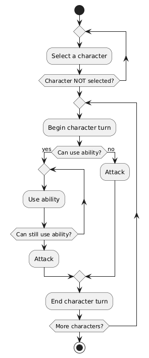

# Rendszerterv

1. __A rendszer célja__
   * A rendszer célja, hogy a felhasználók egy nehéz nap után el tudják ütni az időt egy játékkal, mely elől úgy állnak fel, hogy egy jót szórakoztak és máskor is szívesen leülnek játszani vele.

2. __Projektterv__
    * Projektszerepkörök, felelősségek:
    * __Fő Designer:__ Majoros Máté
    * __Fő tesztelő:__ Zsibók Bence
    * __Főtervező:__ Szabó Balázs

    * Ütemterv:
      * |Funkció/Story|Feladat/Task|Prioritás|Becslés|Aktuális becslés Eltelt idő|Hátralévő idő|
        |-------------|-----------|---------|-------|----------------|----------|-------------|
        |Követelmény specifikáció||0|4|3|4|0|
        |Funkcionális specifikáció||0|5|5|0|5|
        |Rendszerterv||0|8|6|1|5|
        |Frontend|Főmenü elkészítése|1|2|2|0|2|
        ||Pálya elkészítése|1|12|12|0|12|
        ||Karakterek elkészítése|1|12|12|0|12|
        ||Életerőcsík elkészítése|1|4|5|0|5|
        ||Beállítások oldal elkészítése|1|4|3|0|3|
        ||Csaták utáni eredményoldal elkészítése|1|5|5|0|5|
        ||Recruiting felület elkészítése|1|5|5|0|5|
        ||Játék vége képernyő elkészítése|1|5|5|0|5|
        |Backend|Mozgás megvalósítás|10|10|0|10|
        ||Támadás megvalósítása|1|10|10|0|10|
        ||Gyógyítás megvalósítása|1|10|10|0|10|
        ||Körök megvalósítása|1|10|10|0|10|
        ||Életerő változásának megvalósítása|1|10|10|0|10|
        ||Képességek megvalósítása|1|10|13|0|13|
        ||Fejlődés megvalósítása|1|10|10|0|10|
        ||Sereg toborzásának megvalósítása|1|10|10|0|10|
        ||Különböző típusú és képességű karakterek megvalósítása|1|10|10|0|10|

3. __Üzleti folyamatok modellje__
   

4. __Követelmények__
    * Funkcionális követelmények:
      * Csaták játszása
      * Fejlődés
      * Játék végigjátszása
      * Sereg toborzása
      * Gyógyítás
      * Támadás
      * Képességek használata
    * Nem funkcionális követelmények:
      * A felhasználó ne legyen irreálisan erős a képességpontjaihoz képest
    * Törvényi előírások, szabványok:
      * GDPR-nak való megfelelés

5. __Funkcionális terv__
   * Rendszerszereplők:
     * Játékos 1
     * Játékos 2
     * Karakter
     * Ellenfél
   * Rendszerhasználati esetek és lefutásaik:
     * Játékos 1:
       * Csatákat indíthat
       * Kijátszhatja a játékot
       * Tud sereget toborozni
       * Irányítja a saját csapatának karaktereit
     * Játékos 2:
       * Mindent tud mint a Játékos 1
     * Karakter:
       * Tud támadni
       * Tud mozognoi
       * Tud képességeket használni
       * Szintet léphet
       * Tud kört kihagyni
       * Tud körön belül állapotot(phaset) váltani
     * Ellenfél:
       * Mindent tud, mint egy karakter egy csatán belül
   * Menü-hierarchiák:
     * Főmenü
       * Beállítások
       * Játék
     * Beállítások
       * Főmenü
     * Játék
       * Főmenü
       * Recruit felület

6. __Fizikai környezet__
   * Az alkalmazás számítógépekre készül
   * Fejlesztői eszközök:
     * Visual studio code
     * Löve 2D
     * Lua

7. __Felülettervek__
   * Főmenü
     * 
   * Toborzó képernyő
     * 
   * Játék vége képernyő
     * 
   * Beállítások képernyő
     *  

8. __Architektúrális terv__
   * Backend:
     * A backend egy Lua keretrendszerrel, nevezetesen a Löve 2D-vel lesz megvalósítva
   * Frontend:
     * A frontend szintén a Löve 2D keretrendszerrel lesz megvalósítva, illetve saját készítésű karakterekkel és pályákkal

9.  __Implementációs terv__
    * Az egész játékot a Löve 2d keretrendszerben fogjuk megvalósítani, amely képes megjeleníteni a saját készítésű textúrákat is.

10. __Tesztterv__
     * A tesztelések célja a rendszer és komponensei funkcionalitásának vizsgálata, ellenőrzése, a rendszer megfelelő működésének biztosítása.
        * Tesztelési módok:
          * Unit tesztelés:
            A metódusok megfelelő müködésének vizsgálata érdekében teszteket kell írni, amelyek tesztelik az elvárt működést.
          * TDD (Test Driven Development):
            A Test Driven Development (TDD), magyarul tesztvezérelt fejlesztés, egy szoftverfejlesztési módszer, ahol a tényleges kód írását megelőzi a hozzá tartozó tesztek létrehozása.
          * Alfa teszt:
            A teszt elsődleges célja a rendszer funkcióinak és megjelenésének tesztelése külöböző böngészőkben, illetve mobilos böngészőkben. A teszt sikeres ha az oldal megjelenése és fő funkciói elfogadhatóak különböző böngészőkben. A tesztelést a fejlesztők végzik.
        Manuális tesztelés: Az oldal UI elemeit manuálisan is teszteljük.
        * Tesztelendő funkciók:
          * Backend:
              * Képesnek kell lenni csatákat indítani
              * Képesnek kell lenni a karaktereknek fejlödni
              * Képesnek kell lenni a csatán belül támadásokat indítani
              * Képesnek kell lenni a seregünkbe embereket toborozni
              * A megfelelő billentyűzet lenyomásra a megfelelő műveletnek kell végrehajtódni
              * Egy nulla hpn lévő karakterrel nem lehet semmit csinálni
              * Nem lehet a szövetségeseket megtámadni
          * Frontend:
              * Egy csata után helyesen jelzi ki a csata végeredményét
              * A játék során megjelenő szövegek nyelvtanilag helyesek kell hogy legyenek
              * A classokhoz tartozó karakterek helyesen kell hogy megjelenjenek
              * A felhasználói felület elemei megfelelően kell hogy megjelenjenek

11. __Telepítési terv__
    A játékhoz, a játék fájljait le kell tölteni internetről, vagy egy telepítőt, mely a felhasználó által kiválasztott helyre feltelepíti a játékot

12. __Karbantartási terv__
    A játék üzemelése során szükséges annak karbantartása. Alkalmazkodni kell a felhasználók változó igényeihez, esetlegesen új funkciók hozzáadásával fenn tartani az felhasználók érdeklődését, illetve a játék relevanciáját.
    * Karbantartás
      * Corrective Maintenance: A felhasználók által felfedezett és bejelentett hibák kijavítása.
      * Adaptive Maintenance: A program naprakészen tartása és finomhangolása.
      * Perfective Maintenance: A szoftver hosszútávú használata érdekében végzett módosítások, új funkciók, a szoftver teljesítményének és megbízhatóságának fejlesztése.
      * Preventive Maintenance: Olyan problémák feltárása és javítása, amelyek később gondot okozhatnak.
